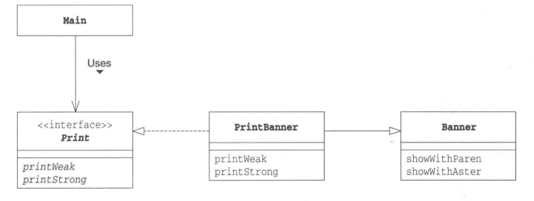
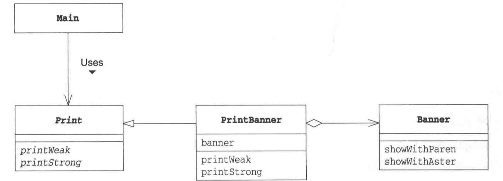

# 适配器模式
## 示例
适配器模式，其实在生活中随处可见，我们每天都能使用到它。最好的例子就是我们常常需要将插座里220V的交流电，通过电源适配器转化为适用于手机、电脑的低压直流电。  

本次两个示例程序中Banner类代表"220V交流电"，Print类(接口)代表实际需求"低压直流电"

现在要做的事情是使用Banner类实现Print类(接口)的功能(需求)，也就是要做一个将"220V交流电"转化成"低压直流电"的适配器。

扮演适配器角色的是PrintBanner类。

Adapter模式有以下两种:
- 类适配器模式(使用继承的适配器)
- 对象适配器模式(使用委托的适配器)

## 类适配器模式(使用继承的适配器) 
### ExtendAdapter

"类适配器模式"的程序类图

如上图PrintBanner类继承Banner类，实现Print接口。在Main方法总中，PrintBanner类的实例保存在了Print类型的变量中，然后用Print接口来进行编程(即用printWeak和printStrong方法)。  

因此对于Main类的代码而言，Banner类、showWithParen方法和showWithAster方法被完全隐藏起来了。这就好比手机电脑只需要在"低压直流电"下工作就行，并不知道"低压直流电"是由适配器从"220V交流电"转化而来。

Main类并不知道PrintBanner类是如何实现的，因此可以在不改变Main类的情况下，改变PrintBanner类的具体实现。

## 对象适配器模式(使用委托的适配器)
### EntrustAdapter

“委托”这个词太过于正式了，说得通俗点就是“交给其他人”。比如，当我们无法出席重要会议时，可以写一份委任书，说明一下“我无法出席会议，安排佐藤代替我出席”。委托跟委任的意思是一样的。在Java语言中，委托就是指将某个方法中的实际处理交给其他实例的方法。

"对象适配器模式"的程序类图

Main类和Banner类与前面的示例完全相同，而Print接口则改变为了类。但是由于Java不支持同时继承两个类，因此无法将PrintBanner类分别定义为Print类和Banner类。

看PrintBanner类的代码中，banner字段中保存了Banner类的实例。该实例是在PrintBanner类的构造函数生成的。然后，printWeak方法和printStrong方法会通过banner字段调用Banner类的showWithParen和showWithAster方法。

## 适配器模式中登场的角色
- Target（对象）  
  该角色负责定义所需的方法。即让手机电脑正常工作所需的低压直流电。在示例程序中，由Print接口（使用继承时）和Print类（使用委托时）扮演此角色。
- Client（请求者）   
  该角色负责使用Target角色所定义的方法进行具体处理。即低压直流电所驱动的笔记本电脑。在示例程序中，由Main类扮演此角色。
- Adaptee（被适配）   
  注意不是Adapt-er（适配）角色，而是Adaptee（被适配）角色。Adaptee是一个持有既定方法的角色。即220V交流电。在示例程序中，由Banner类扮演此角色。 如果Adaptee角色中的方法与Target角色的方法相同（也就是说家庭使用的电压就是低压直流电），就不需要接下来的Adapter角色了。
- Adapter（适配）   
  Adapter模式的主人公。使用Adaptee角色的方法来满足Target角色的需求，这是Adapter模式的目的，也是Adapter角色的作用。Adapter角色就是将220V交流电转化为低压直流电的适配器。在示例程序中由PrintBanner扮演此角色。

.png)

类适配器模式的类图(使用继承)

.png)

对象适配器模式的类图(使用委托)

## 要点
**什么时候使用Adapter模式呢？**  
很多时候，一个需求并非从零开始编程，经常需要用到现有的类。特别是现有的类已经被充分测试过，Bug很少，而且已经被用于其他地方时，就可以将这些类作为组件重复利用。  
Adapter模式会对现有的类进行适配,生成新的类。通过该模式可以很方便地创建需要的方法群。当出现Bug时,由于很明确地知道Bug不在现有的类(Adaptee角色)中,所以只需排查扮演Adapter角色的类即可。  

