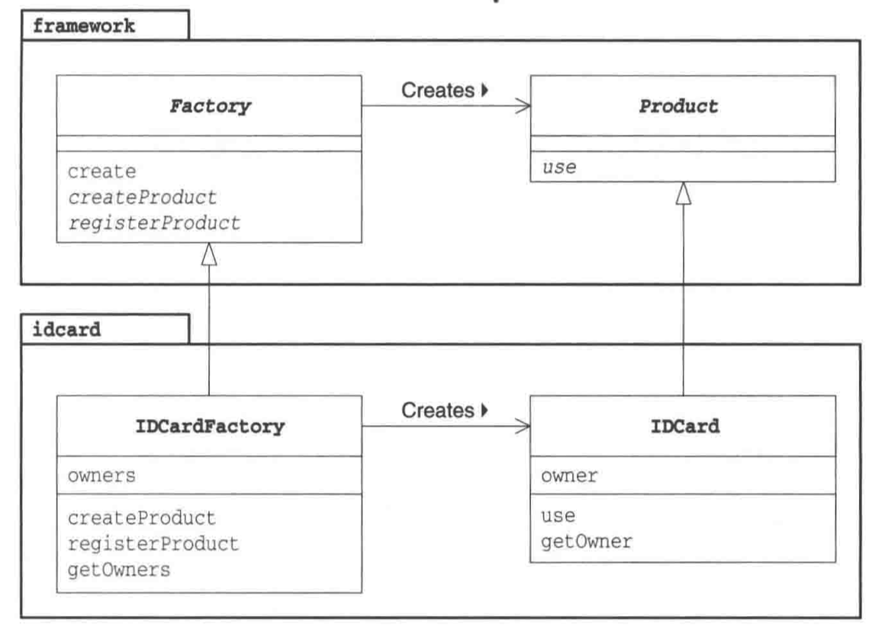

# 工厂模式-将实例的生成交给子类

> 用模板模式来构建生成实例的工厂，这就是工厂模式。    

在工厂模式中，父类决定实例的生成方式，但并不决定所要生成的具体类，具体的处理全都交给子类负责。这样就可以将生成实例的框架（framework）和实际负责生成的实例的类解耦。

## 示例

这段示例程序的作用是制作身份证（IDCard），一共有五个类。

Product类和Factory类属于framework包，这两个类组成了生成实例的框架。

IDCard类和IDCardFactory类属于idcard包，负责实际的加工处理。

Main类是用于测试程序行为的类。

"工厂模式"的示例程序类图

## 工厂模式中登场的角色

- Product（产品）

  Product角色属于框架这一方，是一个抽象类。它定义了生成的那些实例所持有的接口（API），但具体实现由ConcreteProduct角色决定。

- Creator（创建者） 

  Creator角色属于框架这一方，它是负责生成Product角色的抽象类，但具体的处理则由子类ConcreteCreator角色决定。

- ConcreteProduct（具体的产品）

  ConcreteProduct角色属于加工这一方，它决定了具体的产品。

- ConcreteCreator（具体的创建者）

  ConcreteCreator角色属于加工这一方，它负责生成具体的产品。

## 要点

示例中，”框架“和”具体加工“两方面的内容，分别被封装在了framework包和idcard包里。而framework包里的程序全都没有引入idcard包中的代码。，实现了”framework包不依赖于idcard包“。这样的好处是，以后如果要换一个”产品“生产，完全可以不修改framework包中的代码。