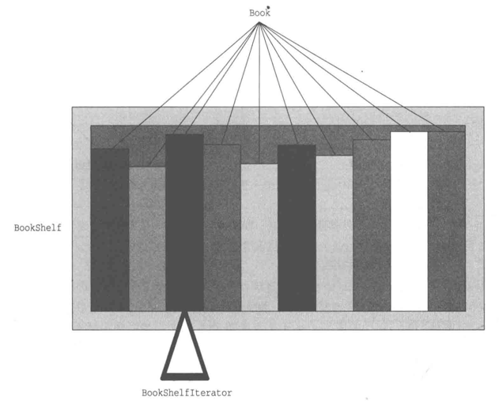
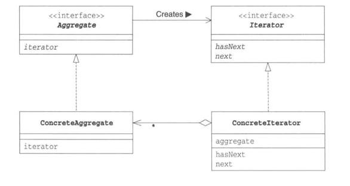

# 迭代器模式
## 示例
该程序的作用是将书(Book)放置到书架(BookShelf)中，并将书的名字按照顺序显示出来。
 

程序示意图

Aggregate接口代表所要遍历的集合的接口。实现了该接口的类将成为一个可以保存多个元素的集合。唯一的方法是Iterator()，用于生成遍历集合的迭代器。

Iterator接口中有两个方法:hasNext()和next()。前者判断集合是否还有下一个元素，主要用于终止循环。后者则是用来取出当前迭代器所指的集合元素，但是也并非仅仅如此，在BookShelfIterator具体实现时，next()方法还将迭代器指向下一个元素。

Book类，name属性指书名。唯一方法getName()获取书名。

BookShelf类，books属性用于存放Book类(最开始为数组，后又改为ArrayList集合)，last属性指当前书架最后一本书的下标。getBookAt(int index)获取该角标的书，appendBook()向数组(集合)中添加书，getLength()获取当前书架大小，iterator()方法会生成并返回BookShelfIterator类的实例作为BookShelf类对应的Iterator。当外部想要遍历书架时，就会调用这个方法。

Main类,通过bookShelf.iterator（）得到的it是用于遍历书架的Iterator实例。while部分的条件当然就是it.hasNext（）了。只要书架上有书，while循环就不会停止。然后，程序会通过it.next（）一本一本地遍历书架中的书。

## 迭代器模式中登场的角色
- Iterator(迭代器)  
  该角色负责定义按顺序逐个遍历元素的接口(API)。
- ConcreteIterator (具体的迭代器)  
  该角色负责实现Iterator角色的接口(API)。
- Aggregate(集合)  
  该角色负责定义创建Iterator角色的接口(API)）。这个接口（API）是一个方法，会创建出“按顺序访问保存在我内部元素的人”。
- ConcreteAggregate(具体的集合)  
  该角色负责实现Aggregate角色所定义的接口(API)。它会创建具体的Iterator角色，即ConcreteIterator角色。

Iterator模式的类图

## 要点
为什么一定要引入Iterator这样的角色呢？直接使用for循环遍历不行吗？  

原因其实很简单:将遍历和实现分离开来，实现解耦。Main方法中遍历是由Iterator接口中的hasNext()和next()完成的，而实际上这两个方法的实现都是在BookShelfIterator中实现的。
~~~~

难以理解抽象类和接口的人常常使用ConcreteAggregate角色和ConcreteIterator角色编程，而不使用Aggregate接口和Iterator接口，他们总想用具体的类来解决所有的问题。  

但是如果只使用具体的类来解决问题，很容易导致类之间的强耦合，这些类也难以作为组件被再次利用。为了弱化类之间的耦合，进而使得类更加容易作为组件被再次利用，我们需要引人抽象类和接口。 

将“不要只使用具体类来编程，要优先使用抽象类和接口来编程”印在脑海中。