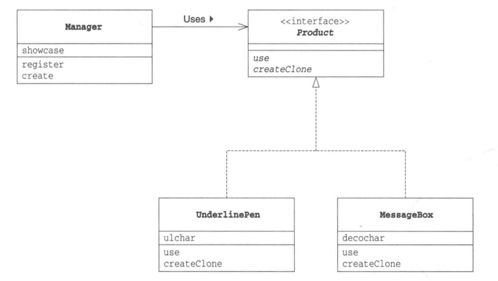
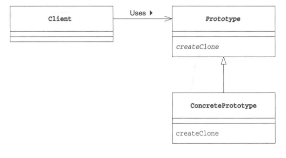

# 原型模式-通过复制生成实例

>在原型模式中，将要学习不根据类来生成实例，而是根据实例原型、实例模型来生成新的实例。

## 示例

"原型模式"示例程序的类图

Product接口和Manger类属于framework包，负责复制实例。虽然Manager类会调用createClone方法，但是对于具体要复制哪个类一无所知。

MessageBox类和UnderlinePen类是两个实现Product接口的类。只要事先将这两个类"注册"到Manager类中，就可以随时复制新的实例。

## 原型模式中登场的角色
- Prototype（原型）  
  Product角色负责定义用于复制现有实例来生成新实例的方法。在示例程序中，由Product接口扮演此角色。
- ConcretePrototype（具体的原型）  
  ConcretePrototype角色负责实现复制现有实例并生成新实例的方法。在示例程序中，由MessageBox类和UnderlinePen类扮演此角色。
- Client（使用者）   
  Client角色负责使用复制实例的方法生成新的实例。在示例程序中，由Manager类扮演此角色。

"原型模式"的类图

## 要点
既然是要创建实例，为什么不直接使用new关键字去创建呢？为什么还需要原型模式呢？  

1. 对象种类繁多，无法将它们整合到一个类中时  
   示例程序中，只生成了三种样式。但只要想要，不论多少种样式都可以生成，但是试想一下每种样式都编写一个类，类的数量将会非常庞大，源程序的管理也会变得非常困难。
2. 难以根据类生成实例时  
   本示例中感觉不到这点。大家可以试想下要开发一个用户可以使用鼠标进行操作的、类似于图形编辑器的应用程序，这样可能更加容易理解。假设我们想生成一个和用户通过一系列鼠标操作所创建出来的实例完全一样的实例。这个时候，与根据类来生成实例相比，根据实例来生成实例要简单得多。
3. 想解耦框架与生产的实例时  
   在示例程序中，我们将复制（clone）实例的部分封装在framework包中了。
   在Manager类的create方法中，我们并没有使用类名，取而代之使用了"strong message"和"slashbox"等字符串为生成的实例命名。与Java语言自带的生成实例的new Something（）方式相比，这种方式具有更好的通用性，而且将框架从类名的束缚中解脱出来了。

