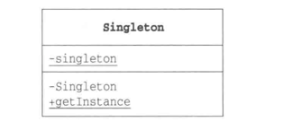

# 单例模式-只有一个实例

> 确保在任何情况下都只生成一个实例的模式称为单例模式

## 示例
直接看示例程序的UML图。（“-”，表示singleton函数是private。此外，getInstance方法带有下划线，表示该方法是static方法）

"单例模式"示例程序的类图

Singleton类的构造函数是private的，这是为了禁止从Singleton类外部调用构造函数。如果从Singleton类以外的代码中调用构造函数new Singleton()，就会出现编译错误。  
因此Singleton模式的作用在于可以确保任何情况下都只能生成一个实例。为了达到这个目的必须设置构造函数为private  
getInstance()方法是以便于程序从Singleton类外部获取Singleton类唯一实例。

## 单例模式中登场的角色

- Singleton  
  在Singleton模式中，只有Singleton这一个角色。Singleton角色中有一个返回唯一实例的static方法。该方法总是会返回同一个实例。

"单例模式"的类图

## 要点
单例模式比较简单，唯一的诉求就是确保程序中只有一个实例。因此必须使用private修饰构造方法，使其不能在外部被调用。  
什么时候生成实例的呢？  
不难发现，在第一次调用getInstance()方法时，Singleton类会被初始化，也就是在这是，static字段的singleton被初始化，生成了唯一的实例。