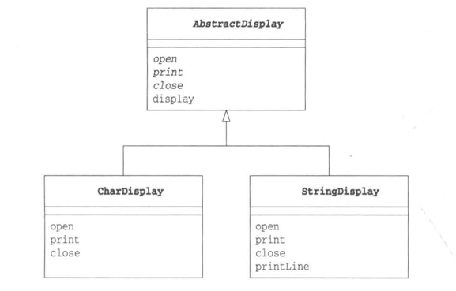
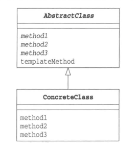

# 模板模式--将具体处理交给子类

### 在父类中定义处理流程的框架，在子类中实现具体处理。

## 示例
示例程序中，一共出现了四个类，分别是AbstractDisplay、CharDisplay、StringDisplay和Main。

AbstractDisplay类中定义了display方法，而且该方法中依次调用了open，print，display方法。但这三个方法都是抽象方法，并没有具体实现。这里调用方法的display方法就是模板方法。

具体实现open，print，display方法的是AbstractDisplay的子类CharDisplay类和StringDisplay类。

Main类是用于测试程序行为的类。

"模板模式"的程序类图

## 模板模式中登场的角色
- AbstractClass(抽象类)

  AbstractClass角色不仅负责实现模板方法，还负责声明在模板方法中所使用到的抽象方法。这些抽象方法由子类ConcreteClass角色负责实现。在示例程序中，由AbstractDisplay类扮演此角色。

- ConcreteClass(具体类)

  该角色负责具体实现AbstractClass角色中定义的抽象方法。这里实现的方法将会在AbstractClass角色的模板方法中被调用。在示例程序中，由CharDisplay类和StringDisplay类扮演此角色。

"模板模式"的类图
 

## 要点

**可以使逻辑处理通用化**：由于在父类的模板方法中编写了算法，因此无需在每个子类中再编写算法，方便后续的维护和扩展。

**父类与子类之间的协作**：在模板方法中，父类和子类是紧密联系的、共同工作的。因此子类实现父类的抽象方法时，必须十分了解模板方法中是如何调用这些抽象方法的。

**父类与子类的一致性**：子类的实例都是保存在父类的变量中的，然后再去调用模板方法。

无论在父类类型的变量中保存哪个子类的实例，程序都可以正常工作，这种原则称为**里氏替换原则**（The Liskov Substitution Principle，LSP）。当然，LSP并非仅限于Template Method模式，它是通用的继承原则。

